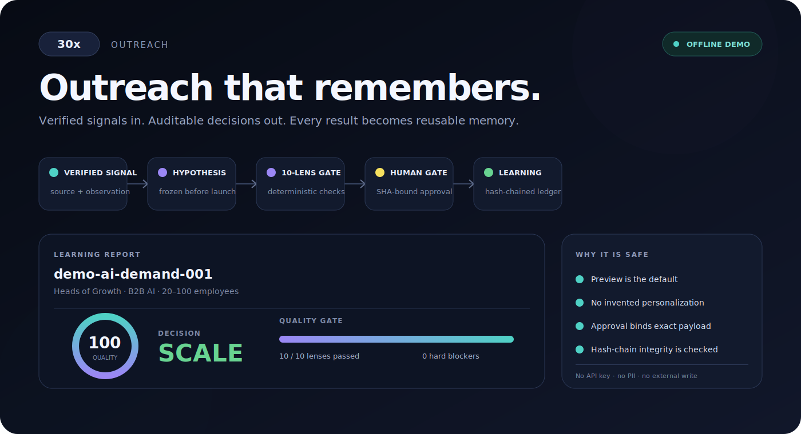
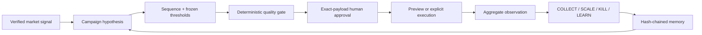

<!--
[INPUT]: 依赖可安装 30x CLI、离线 demo、schemas、安全边界与社区文档
[OUTPUT]: 对外提供产品定位、30 秒 quickstart、工作流、扩展与贡献入口
[POS]: repo 的公共首页；只展示可运行能力并明确区分 demo 与真实结果
[PROTOCOL]: 变更时更新此头部，然后检查 AGENTS.md
-->
# 30x Outreach

**The experiment control plane for outbound teams that want learning—not another email cannon.**

[](https://github.com/norahe0304-art/30x-outreach/actions/workflows/ci.yml)
[](https://www.python.org/)
[](LICENSE)
[](#safe-by-construction)



30x turns verified market signals into reviewable outbound experiments. It freezes success criteria before launch, separates deterministic checks from AI judgment, binds human approval to the exact payload, and preserves aggregate results in a hash-chained learning ledger.

## Run the proof in 30 seconds

Python 3.9+ is the only prerequisite. The demo uses fictional `.example` data and makes no network request.

```bash
python3 -m pip install "git+https://github.com/norahe0304-art/30x-outreach.git"
30x demo
```

You get immediate terminal feedback plus a self-contained `30x-demo-report.html` that can be opened or shared offline:

```text
30x OUTREACH · LEARNING REPORT
Campaign   demo-ai-demand-001 · v1
Quality    100.0/100 · READY_FOR_HUMAN_REVIEW
Decision   SCALE · primary metric cleared the scale threshold

Signal → Hypothesis → Sequence → Approval → SCALE → Next wave
```

The demo proves the workflow, not production campaign performance. Its aggregate observation is explicitly marked simulated.

## The product loop



The durable artifact is not just copy. It is the chain of evidence connecting audience, message, approval, result, and the next decision.

## What 30x actually enforces

| Risk | Executable control |
|---|---|
| Invented personalization | Claims require a sourced `verified: true` evidence object |
| Vague “AI quality” | Ten named, inspectable lenses plus hard blockers |
| Approval drift | Reviewer, recipient count, campaign, and exact JSON are SHA-256 bound |
| Accidental sending | Preview is default; destination writes require `--execute` |
| Post-hoc storytelling | Hypothesis, metric, guardrails, sample, and thresholds freeze before launch |
| Forgotten experiments | Aggregate decisions append to a SHA-256 chained JSONL ledger |
| Vendor lock-in | Source, verifier, and destination are Python Protocols discovered by entry point |

AI may propose audiences, hypotheses, and copy. It cannot invent evidence, approve itself, rewrite thresholds after seeing results, or silently cross an external-write boundary.

## CLI

| Command | Outcome |
|---|---|
| `30x demo` | Run the complete offline proof and render HTML |
| `30x evaluate CAMPAIGN` | Apply the deterministic ten-lens quality gate |
| `30x decide CAMPAIGN OBSERVATION` | Compute a frozen four-state decision |
| `30x approve PAYLOAD --by ID --output MANIFEST` | Bind human approval to exact content |
| `30x verify PAYLOAD MANIFEST` | Fail if approved content changed |
| `30x record CAMPAIGN OBSERVATION` | Append an aggregate decision to the learning ledger |
| `30x history` | Read the local experiment memory |
| `30x verify-ledger` | Check chain integrity and optionally match a trusted head |
| `30x providers` | Inspect provider capabilities, write surfaces, and required env vars |
| `30x doctor` | Check offline and optional live-integration readiness |

Run `30x COMMAND --help` for exact options.

## A real experiment, end to end

Start from the schemas and package demo:

- [`campaign-spec.schema.json`](thirtyx/contracts/campaign-spec.schema.json) freezes audience, evidence, sequence, and decision rules.
- [`experiment-observation.schema.json`](thirtyx/contracts/experiment-observation.schema.json) contains aggregate metrics only.
- [`decision-record.schema.json`](thirtyx/contracts/decision-record.schema.json) captures the deterministic result.
- [`approval-manifest.schema.json`](thirtyx/contracts/approval-manifest.schema.json) binds human review to content.
- [`learning-record.schema.json`](thirtyx/contracts/learning-record.schema.json) chains experiment memory without recipient PII.

```bash
30x evaluate campaign.json --output evaluation.json
30x decide campaign.json observation.json --output decision.json --html report.html

30x approve approved-payload.json \
  --by YOUR_IDENTITY \
  --campaign-id YOUR_CAMPAIGN \
  --output approval.json

30x verify approved-payload.json approval.json
30x record campaign.json observation.json --ledger .30x/learning.jsonl
30x verify-ledger --ledger .30x/learning.jsonl
```

Decision states are deliberately small:

- `COLLECT` — minimum evidence is missing.
- `KILL` — a safety guardrail failed or the primary metric crossed the frozen kill rule.
- `SCALE` — all guardrails passed and the scale rule cleared.
- `LEARN` — evidence is sufficient but remains between kill and scale.

## Safe by construction

### Evidence before personalization

A job title and company name are targeting context, not proof of intent. Without a sourced observation, 30x emits no personalized claim. It does not fill the gap with “impressive momentum” or fake familiarity.

### Approval before execution

Approval is a machine-verifiable manifest, not a chat message. Any edit to the approved payload changes its canonical SHA-256 hash and invalidates the manifest.

### Memory without recipient identity

The learning ledger stores campaign-level hypotheses, aggregate observations, and deterministic decisions. Every record includes the previous record’s hash, so in-place edits and broken links are detectable. Pin the printed head in an external system and pass `--expect-head` to detect a full-chain rewrite. Recipient names and emails do not belong there.

### External writes stay explicit

The provider-neutral pipeline only calls a destination when `execute=True`. The live sender also fails closed on a missing or mismatched approval, missing credentials, suspicious content, daily-limit exhaustion, or duplicate recipient. Before crossing SMTP, it persists a `pending` journal entry; a crash at the delivery boundary therefore stops a later retry instead of risking a duplicate message.

## Live integrations

The current live adapters support Apollo sourcing, LeadMagic verification, Instantly dedupe/upload, and SMTP sending. They remain under `scripts/` while each is migrated behind the stable provider contract.

```bash
git clone https://github.com/norahe0304-art/30x-outreach.git
cd 30x-outreach
python3 -m venv .venv
source .venv/bin/activate
python -m pip install -e .
cp .env.example .env
cp config.example.json config.json
30x doctor
```

Credentials are environment-only. Run the lead pipeline without `--execute`, inspect the staged audience and counts, then opt into the same reviewed command with `--execute`.

```bash
python scripts/lead-pipeline.py \
  --titles "VP Marketing,Head of Growth" \
  --industries "AI,SaaS" \
  --company-size "20,100" \
  --locations "United States" \
  --campaign-id YOUR_CAMPAIGN \
  --volume 100
```

Operators remain responsible for consent, suppression lists, platform terms, deliverability, and applicable laws.

## Extend it

Provider packages expose a `ProviderInfo` descriptor plus one source, verifier, or destination capability. Entry points in the `thirtyx.providers` group make runnable instances discoverable without adding vendor imports to core.

See [Provider extensions](docs/PROVIDERS.md) for a minimal implementation and [Architecture](docs/ARCHITECTURE.md) for trust boundaries. Current priorities live in the [Roadmap](docs/ROADMAP.md).

## Develop

```bash
git clone https://github.com/norahe0304-art/30x-outreach.git
cd 30x-outreach
python3 -m venv .venv
source .venv/bin/activate
python -m pip install -e .
python -m unittest discover -s tests -v
```

The suite is offline and uses fictional inputs. CI verifies Python 3.9, 3.11, and 3.12, the installable CLI, approval integrity, schemas, preview-only behavior, the learning chain, and wheel construction.

Read [Contributing](.github/CONTRIBUTING.md), [Security](.github/SECURITY.md), and the [Changelog](docs/CHANGELOG.md) before opening a PR.

## Credits

Built on Eric Siu’s MIT-licensed [`ai-marketing-skills/outbound-engine`](https://github.com/ericosiu/ai-marketing-skills/tree/main/outbound-engine). This project adds persistent multi-ICP state, evidence contracts, deterministic evaluation, exact-payload approval, preview-first execution, provider protocols, aggregate learning memory, schemas, tests, CI, and release infrastructure.

## License

MIT — see [LICENSE](LICENSE).
