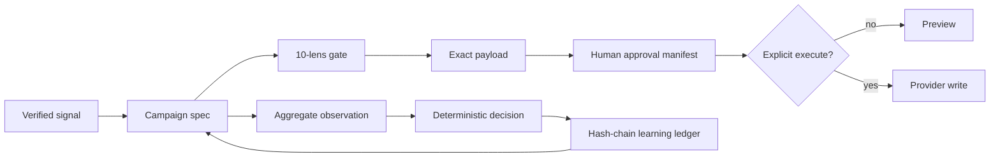

<!--
[INPUT]: 依赖 root AGENTS.md、thirtyx package、scripts adapters 与 schemas 的真实结构
[OUTPUT]: 对外提供 30x 的数据流、信任边界与模块职责地图
[POS]: docs 的系统设计真相源；架构变化必须同步更新
[PROTOCOL]: 变更时更新此头部，然后检查 AGENTS.md
-->
# Architecture

30x separates creative judgment from the controls that must be deterministic. AI can help propose an ICP, hypothesis, or sequence. It cannot silently invent evidence, approve itself, change a frozen threshold, or write to an external system.

## Data flow

## Trust boundaries

| Boundary | Rule | Failure mode |
|---|---|---|
| Evidence | A claim needs an observation, source, and `verified: true` | Omit personalization |
| Quality | Ten transparent lenses plus hard blockers | Return `REVISE` |
| Approval | SHA-256 binds reviewer to exact JSON and recipient count | Reject changed payload |
| Execution | Preview by default; writes require `--execute`; SMTP journals before delivery | Perform no write or stop on unresolved pending delivery |
| Decision | Thresholds are frozen in the campaign spec | Return one deterministic state |
| Memory | Aggregate records form a SHA-256 chain | Report the first broken record |

## Core modules

- `thirtyx/evaluation.py` performs deterministic copy and experiment checks.
- `thirtyx/decision.py` maps aggregate observations to `COLLECT`, `SCALE`, `KILL`, or `LEARN`.
- `thirtyx/approval.py` canonicalizes payloads and verifies immutable approval manifests.
- `thirtyx/pipeline.py` orchestrates source, verify, dedupe, and destination protocols.
- `thirtyx/providers/` discovers third-party adapters without coupling core logic to a SaaS vendor.
- `thirtyx/learning/` stores aggregate experiment memory in a hash-chained JSONL ledger and exposes a head for external pinning.
- `thirtyx/rendering/` creates terminal and single-file HTML proof artifacts.
- `scripts/` contains transitional live adapters and compatibility entry points.

## Contracts

Every stage has a wheel-packaged JSON Schema under `thirtyx/contracts/`. Campaigns and observations are inputs. Decisions are computed outputs. Approval and learning records are append-only evidence. Public demos use reserved `.example` addresses and simulated aggregate metrics.

## Dependency rule

Core modules may depend on the standard library and stable package contracts. They may not import Apollo, LeadMagic, Instantly, SMTP, or any future provider. Provider-specific behavior stays behind a Protocol or in `scripts/` until promoted to an adapter package.
